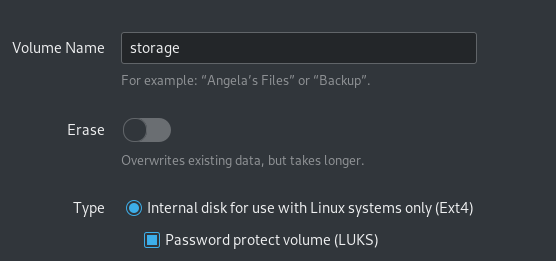
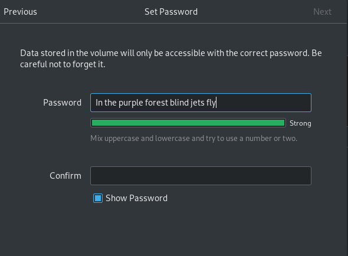
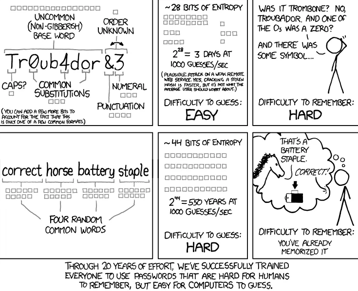
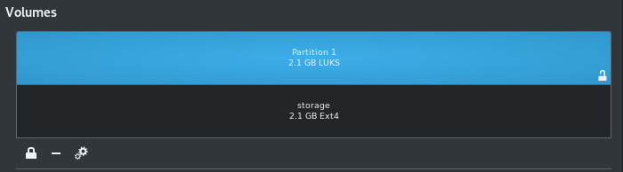
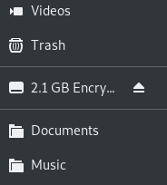
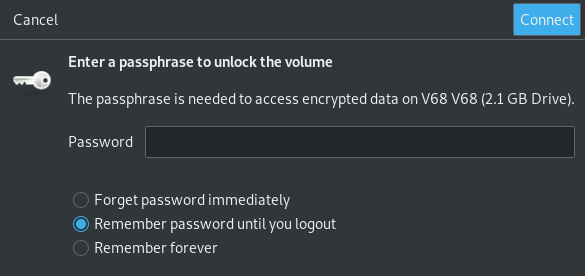

# LUKS disk encryption

*This guide is focused on Linux systems*.

* Go to Accessories --> Disks
* Select the USB you want to encrypt
* select the double wheel and choose *'Format partition'*
* Enter Volume name - can be anything
* In type --> ie. select *'For use with Linux systems only (Ext4)*'. It is also possible to select for all systems and devices or Windows use.  
    * Select *'Password protect volume (LUKS)'*.



* Enter a password. Confirm and click *'Next'*.



* Make sure the password is not predictable. See below.



* There will be a warning that all content on the disk will be deleted.


* Select *'Format'* --> The encrypted disk will now be created.
* In the information *'Content'* the user can see if the disk is unlocked or locked. After the encrypted partition has been created it is unlocked and it looks as if there are two partitions with equally big size while it is in fact one. This is how is looks like when it is unlocked.



* Clicking on the lock icon to the left will lock the partition and only one will remain visible.
* To open an ecnryped disk: In the folder manager --> click on the encrypted disk name.



* Enter password to access content in encrypted disk. For security purposed, NEVER select *'Remember forever'* for password.



* When finished --> Unmount the disk (a little eject icon to the right of the storage name in the folder manager).


# Troubleshooting

If the owner is set to root, it won't be possible to create folders, paste documents etcetera. If this happens, do this:

- In Accessories/Disks (might be in differebt location depending on OS) where the user is encrypting the USB, there is device information, ie. /dev/sda1 which is the name of the USB. Note it down.

```bash
sudo chmod 700 /dev/sda1
```

- Chmod 700 means that the owner have all permissions. Che [this](https://linuxhandbook.com/chmod-command/) out for more info about chmod.

- Now there should be no problem accessing and creating content on the USB.

# LUKS disk encryption via terminal

```bash
sudo apt install cryptsetup 
```

**To see a list of available disks. In terminal, run:**

```bash
lsblk
```

- The usual name for external disk are sda, sdb etcetera. The list will also show the size of the disk, which will facilitate identifying which one. The whole path should be:  
/dev/sda unless more than one USB is being plugged in.

**To encrypt the disk, run:**

```bash
sudo cryptsetup -y -v luksFormat /dev/sda
```

- This will warn the user that all content on the disk will be deleted if proceeding.  
- If accepted --> Enter password.  
- Completed.

**To open the encrypted disk:**

- Check the name of the device again:

```bash
lsblk
```

```bash
sudo cryptsetup luksOpen /dev/sdb
```
- Note that when unlocking the name of the disk will change.  
- The user is notified (example below, can be a different name): 

>Unlocked /dev/sda as /dev/dm-4.

**Mounting:**


