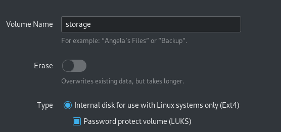
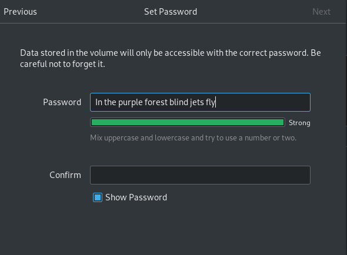
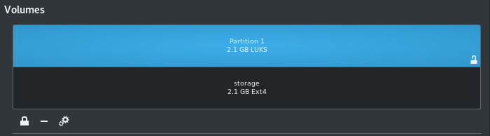
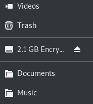
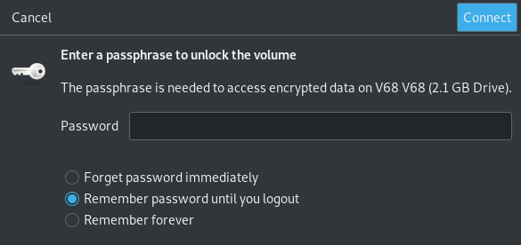

# LUKS disk encryption

* Go to Accessories --> Disks
* Select the USB you want to encrypt
* select the double wheel and choose *'Format partition'*
* Enter Volume name - can be anything
* In type --> ie. select *'For use with Linux systems only (Ext4)*'. It is also possible to select for all systems and devices or Windows use.  
    * Select *'Password protect volume (LUKS)'*.

* Enter a password. Confirm and click *'Next'*.

* Make sure the password is not predictable.

* There will be a warning that all content on the disk will be deleted.

* Select *'Format'* --> The encrypted disk will now be created.
* In the information *'Content'* the user can see if the disk is unlocked or locked. After the encrypted partition has been created it is unlocked and it looks as if there are two partitions with equally big size while it is in fact one. This is how is looks like when it is unlocked.

* Clicking on the lock icon to the left will lock the partition and only one will remain visible.
* To open an ecnryped disk: In the folder manager --> click on the encrypted disk name.

* Enter password to access content in encrypted disk. For security purposed, NEVER select *'Remember forever'* for password.

* When finished --> Unmount the disk (a little eject icon to the right of the storage name in the folder manager).

