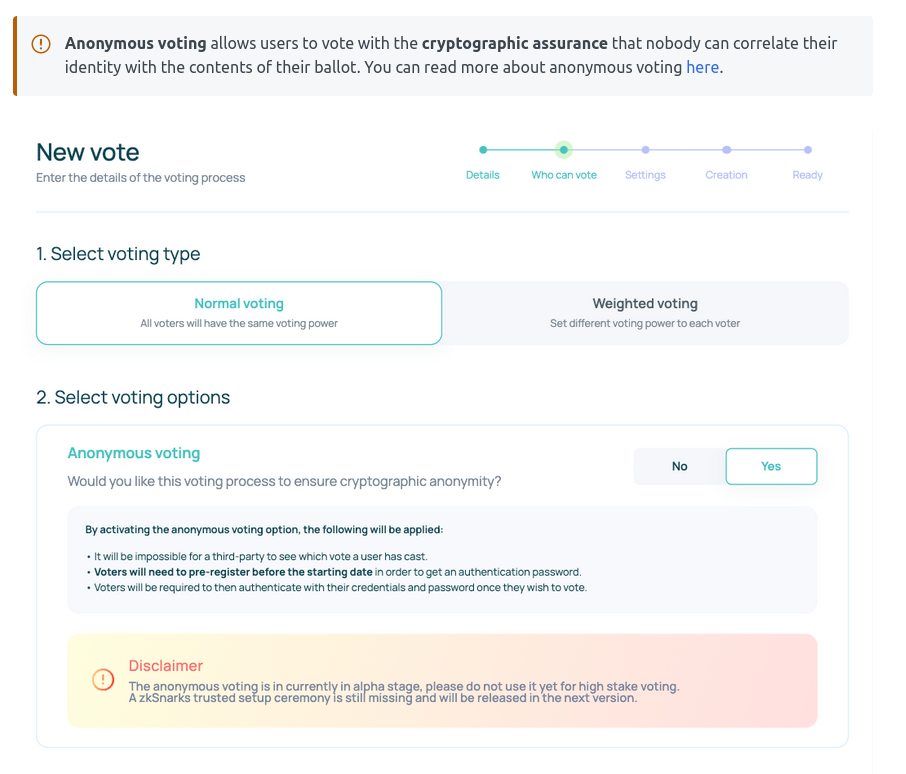

# Anonymous voting

## Aragon

- Alpha stage.  
- Third party cannot see how a user have cast their vote.  
- Pre-registrations needed to get authentication password.  
- Voter authenticate with credentials when they wish to vote.  
- Two voting options: all voters have the same voting power or token weighted voting

- [https://documentation.aragon.org/products/aragon-vocdoni/navigating-your-vocdoni-organization/creating-a-voting-proposal](https://documentation.aragon.org/products/aragon-vocdoni/navigating-your-vocdoni-organization/creating-a-voting-proposal)
[https://documentation.aragon.org/products/aragon-vocdoni/navigating-your-vocdoni-organization/voting-on-a-proposal-1](https://documentation.aragon.org/products/aragon-vocdoni/navigating-your-vocdoni-organization/voting-on-a-proposal-1)

