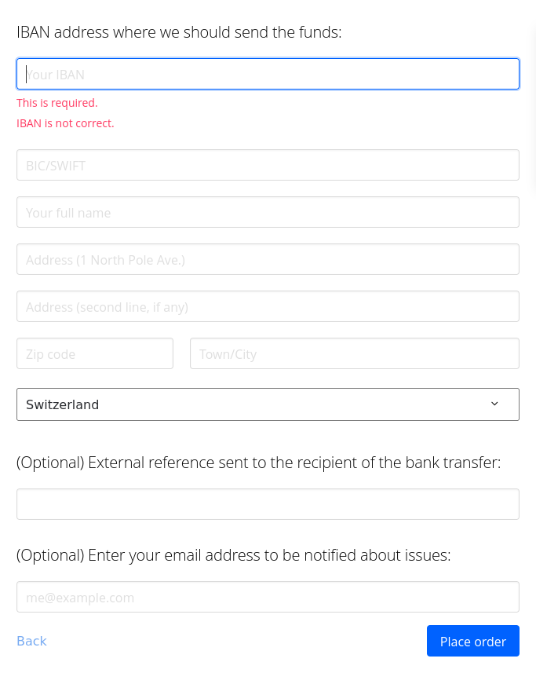

# Crypto to Fiat

## Introduction

This guide is focused on how to withdraw crypto to cash in an anonymous way, which will include ATM and OTC options. There might be other solutions out there which we encourage the community to share with each other on the [forum](forum.lunardao.net). 

Banks are fundamental for economic surveillance. Payment cards track purchases and map out our lives. Not our keys, not our cash - which means that money in the bank are imaginary funds which can be frozen or taken away. This compromises our privacy as well as our autonomy. 

There are grey zones in regards to withdrawals, ie. ways to use a fully centralized exchanges (CEX) like Kucoin in an anonymous way. These are not included in this guide as the aim is to improve our knowledge and skills for privacy solutions and a CEX is not just centralized, but also non reliable and counter-intuitive to anyone who seeks to develop sovereignty.

## Considerations 

Here are some things to keep in mind before starting.

- It is preferred to start these operations on [Tails](https://tails.boum.org/install/) or in a [Virtual machine](https://wiki.lunardao.net/virtualbox_whonix.html). If so, the second point below is not needed.
- If using a regular OS --> Do not operate without hiding IP address and metadata. Use for example [NYM](https://nymtech.net/), [HOPR](https://hoprnet.org/) or [Lokinet](https://lokinet.org/).
- If nothing else, use VPN, such as [ProtonVPN](https://protonvpn.com/download) or [Mullvad VPN](https://mullvad.net/en/pricing/) (remember that VPNs hides location, but not necessarily metadata. The VPN provider can observe your origination point) or use [Tor browser](https://www.torproject.org/download/).
- Do not use same wallet which you have used for doxxed crypto and do no not use this wallet going forward with doxxed crypto. This wallet should be completely separate from any other activity you've done on-chain or off. Check [Anonymizing assets](https://wiki.lunardao.net/anonymizing_assets.html) for more information.
- If applications are used on a phone, such as [Cake wallet](https://cakewallet.com/), the privacy of the phone matters. Take a look at [Privacy setup](https://wiki.lunardao.net/privacy_setup.html) for a more secure phone setup.

Every withdrawal to fiat which is not OTC (to paper cash) or non-KYC ATM (to paper cash) is one way or the other KYCed or traceable. The credit card/bank account to which you are withdrawing is assigned to a real identity and on-chain data is accessible to anyone.

Privacy is more expensive as the % of conversion/swap fees are higher - usually 2-3% per on chain swap --> DYOR (= Do Your Own Research). Privacy solutions are not mass adopted (yet) and the nation-states and large tradFi players push billions into KYC crypto, while waging a war against anonymity (of any data).

## Questions

1. Which crypto currency do you want to convert to, on which network and with which wallet?
3. What types of exchanges do you have access to? ( ie. DEX and swaps)
4. What tools for withdrawal do you want to use? Which means do you have? (OTC, ATM, bity)

Take few minutes and a sheet of paper. Sketch the whole process before starting to move money around. This may save time, risk exposure and savings spent on expensive fees or worse on wrongly made transactions.

# Means of Withdrawing

- **$XMR** (Monero) - is the #1 privacy coin at the moment, though there are more and more privacy projects developing alternatives.
- Anonymous withdrawals to cash must be Over the Counter (OTC, peer-to-peer) or non-KYC ATMs.
- These services usually take BTC (or ETH or some normie coins) but not XMR, so there is a need to exchange or swap BTC without being connected to the original account.
- To remain private and anonymous we must be absolutely sure to not connect to any accounts/wallets/IPs we use with doxxed crypto and our identity in general.

# Crypto We Want to Sell and Tools of Exchanging

In case we were paid in USDC/USDT/DAI and want to cash out - How do we get these to BTC?

## DEX, Bridges & Swaps

**In case BTC is the coin for the final trade -  Option 1**

- First, create a BTC wallet (even a hot one for temporary use). Preferrably [**Electrum**](https://electrum.org/#home) on [**TAILS**](https://tails.boum.org/install/) (save the seed and password well, ie. in [KeepassXC](https://keepassxc.org/)).
- Monero can be swapped on [Trocador](trocador.app) which is a swap aggregator or [Majestic Bank](https://majesticbank.sc/). Both of these sites have onion services.
- In case XMR wasn't the payment method (and BTC is the currency for withdrawal), we need to run our transaction through XMR before getting to the final/"clean" BTC.
- This means to:
1. Swap your coin to XMR. Use:  
- [Trocador](trocador.app)  
- [Fixed float](fixedfloat.com)  
- [Stealthex](https://stealthex.io/)
2. Send to another XMR wallet that is not connected to the same node, or to a XMR wallet that is running on own XMR node. You can use [Cake Wallet](https://cakewallet.com/) for this. This adds complexity in case you are being tracked by any of the services you've used so far. Here is more info on how to [run a node](https://www.monero.how/how-to-run-monero-node). 
3. Swap to BTC in [Cake Wallet](https://cakewallet.com/) using Cake Wallet's exchange feature. Use Cake wallet with [tor](https://guides.cakewallet.com/docs/advanced-features/tor-with-orbot/).

**In case BTC is the coin for the final trade -  Option 2**

- In this option, the assets for withdrawal are in ETH.
- Go through the steps in [Anonymizing assets](https://wiki.lunardao.net/anonymizing_assets.html).
1. Swap your coin to XMR. Use:  
- [Trocador](trocador.app)  
- [Fixed float](fixedfloat.com)  
- [Stealthex](https://stealthex.io/)
2. Withdraw via non-KYC ATMs for BTC (most are KYC, so check carefully). [List of BTC ATMs](https://coinatmradar.com/countries/). The limit is generally 900 Euros.

**Possibilities:**

1. **Bity to family or friend**  
Run XMR transaction, swap to clean BTC, new TAILS wallet, and use non registered [bity.com](bity.com) transaction (crypto to card) via a friend or a family member, who can withdraw and pass cash. The withdrawal via Bity is limited to 900 Euros at a time without KYC.

- **This will obscure:** Where the money originated, what was the total sum, and the fact it went directly to you.
- **It will reveal:** The sum of withdrawal, the BTC address, that someone around you cashed out $ from new BTC wallet.

**How to make a Bity transaction**

- Go to [bity.com](bity.com).  
- Select BTC as the currency to use for the withdrawal.  
- select EUR for the currency that will end up on the account of the friend or family member (any fiat money).

- When amount had been specified - *'Place order'*.  
- Select *'Continue as Guest'*.

- Select *'Other'* for sending wallet.

- Confirm (or change if needed) the amount. Press *'Continue'*.

- Enter IBAN to the account the money will be sent to.  
- Enter BIC/SWIFT.
- Enter full name of the recepient (friend or family member).  
- Enter this persons address.  
- For *'External reference'* one can write *Private loan* to not get any hustle with sudden money to the account.  
- If there is a wish to get notified in case of any issues: Do not use a doxxed email. Set up an email account via ie. [Protonmail](proton.me) while on tails, to protect against tracking.
<!---violet: sometimes proton (happened to me once) asks for some kind of verification through email or phone number to set up an account so it could be useful to list here some ways to do that anon (like temporary email providers)---> 

- *'Place order'* --> Within ten minutes the money need to be send to the address which Bity displays. Use the electrum wallet on tails which has been set up for this purpose.  
- After the transactions has been sent, verfify on Bity that it is completed.

For this option it's also possible to go through steps in [Anonymizing assets](https://wiki.lunardao.net/anonymizing_assets.html) and then proceed to [bity.com](bity.com) using ETH. See *'How to make a Bity transaction'* above. The only difference is that instead of electrum, a Metamask account is used, and instead of BTC, ETH.

2. **Join local crypto communities/chats**  
See when someone wants to buy XMR and settle with them.
- **Advantage:** best price, no fees, no %, no hustle, relatively secure.
- **Reveal:** Amount, time and place of the trade to a person who under pressure can reveal these data.
- https://juraj.bednar.io/en/blog-en/2022/03/14/how-to-create-your-own-crypto-trading-group/

3. **OTC exchange**  
Find out who is doing OTC exchanges where you live. This usually cost 1-3% fee for withdrawal. The accepted currencies can vary. The benefit is that the OTC exchanger doesn't want to reveal their customers as this is their source of income. The negative part is that the only base of trust is monetary, though minimum information can be shared.

# Step by Step Practical Examples

In this example we aim to get 900 Euros out from an ATM in a private way, starting from Bitcoin.

1. Check where your ATM is, what % fees and static fees are included.
2. Sketch out the whole path of swaps and calculate all the fees.
3. Install new [Cake wallet](https://cakewallet.com/) or [Monerujo](https://www.monerujo.io/) on phone and [Monero cli](https://www.getmonero.org/downloads/#cli) (or [GUI wallet](https://www.getmonero.org/downloads/)) on Linux (preferably on TAILS), or make two [Cake wallets](https://cakewallet.com/).
4. Calculate 900E into USD, add all the fees on the way (ATM, swaps, transactions)
5. Add at least 1% for volatily (price changes) on top and calculate how much BTC that will be. 
6. Swap that BTC to XMR using [Trocador](trocador.app) or [Majestic bank](majesticbank.sc).
7. Send XMR to another [Cake wallet](https://cakewallet.com/) (CLEAN!!! --> this means that the wallet has been set up while protecting IP address and metadata).
8. Swap back to BTC using [Trocador](trocador.app) or [Majestic bank](majesticbank.sc). Use a different swap service to prevent the services from performing correlation attacks.
9. Withdraw from non-KYC ATM, be as inconspicuous as possible (read notes on privacy).

# Note on Privacy

- Remember what wallets your identity is connected to: your phone, Bank Account, MAC, IP, KYC, paying to your family etc. Label all of your wallets if the wallet software allows it. The labels are usually not restored when restoring wallets to different device, so be aware.
- If aiming for privacy - use:
  - Non-KYC ATMs
  - All "covid prevention" (glasses, gloves and respirator when withdrawing)
  - Do not travel there with your personal phone in your pocket.
  - Do not swap big amounts of money with people close to you such as a classmate or colleague because it's cheaper and non KYC - that person is a security risk for your private tx.
- You don't always have a need to be fully anonymous, but when you do --> Do not act on hope, use excuses or be lazy. Privacy won't be served by the ones who are the most interested in data gathering and transaction monitoring!

# Resources

- See [**Privacy tools**](https://wiki.lunardao.net/list_privacy_tools.html) section about *Virtual payment cards* for anonymous payments cards to which the user can deposit crypto.

- See [**Privacy projects**](https://wiki.lunardao.net/crypto_privacy_projects.html) section on *P2P Trading platforms* about local BTC and Monero exchanges.

- [**List of BTC ATMs**](https://coinatmradar.com/countries/)
